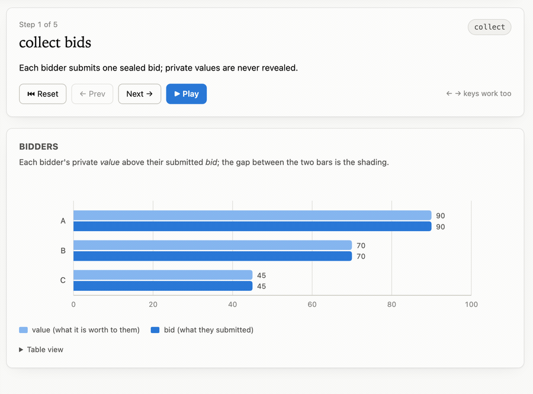
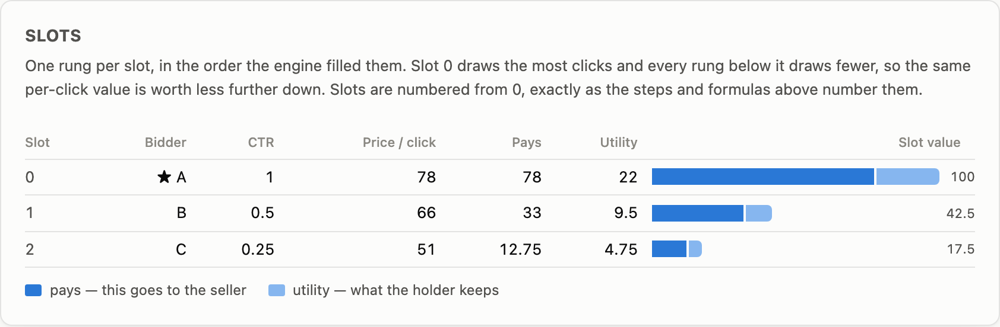
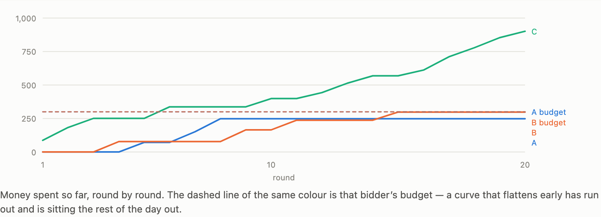
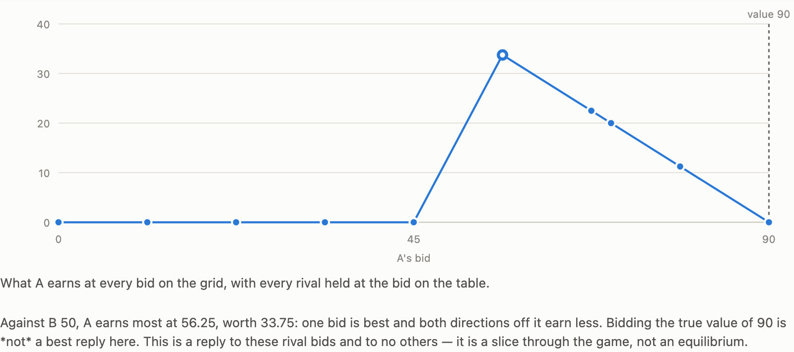

# auction-lab

Watch auction mechanisms run, one algorithmic step at a time.

[](https://github.com/choosen23/auction-lab/actions/workflows/tests.yml)
[](LICENSE)

Set up bidders and their private values, pick a mechanism, and step through it: bids arrive, get
sorted, a winner is chosen, a pricing rule fires, payments settle. Every step shows the rule that
fired and the numbers it produced.



```
python3 -m agt.serve
```

Then open <http://127.0.0.1:8000>. No dependencies, no build step — Python 3.11+ stdlib and vanilla
JS. `--port` changes the port.

The page opens on a worked example. Along the top is a row of them, each a question rather than a
setting — *Honesty is safe*, *Why everyone shades*, *Losers pay too*, *The budget runs out* — and
one click fills the whole form and runs it. Every example lives in `agt/presets.py` and arrives over
`GET /presets`, so the browser still knows no mechanism by name; `tests/test_presets.py` posts each
one to the endpoint it will actually reach, because a chip that fails when clicked is worse than no
chip at all.

## Mechanisms (phase 1)

| Name | Rule | Lesson |
|---|---|---|
| `first_price` | Highest bid wins, pays own bid | Rewards shading; bidding your value earns nothing |
| `second_price` | Highest bid wins, pays highest losing bid | Truthful bidding is dominant |
| `all_pay` | Highest bid wins, **everyone** pays their bid | Losers go negative |
| `english` | Ascending clock, last bidder standing | Equivalent to second-price |
| `dutch` | Descending clock, first to accept | Equivalent to first-price |

All support a `reserve` price. A reserve that blocks the sale is flagged inefficient — that cost is
the point.

## Selling more than one thing (phase 3)

**Position auctions** sell several ad slots to the same scalar per-click bids. Slot *i* gets
`ctr_decay ** i` of the clicks slot 0 gets.

| Name | Rule |
|---|---|
| `gsp` | Slots go to the highest bids; each winner pays the **next bidder's** bid per click |
| `vcg_positions` | Same allocation, but each winner pays the externality they impose |

They exist to be compared. On identical input they allocate *identically* and charge differently —
and only one of them is truthful:

| A values clicks at 10, B bids 8, C bids 2, two slots | honest (bid 10) | lying (bid 3) |
|---|---|---|
| `gsp` | slot 0, pays 8, utility **2** | slot 1, pays 1, utility **4** ← lying wins |
| `vcg_positions` | slot 0, pays 5, utility **5** ← honesty wins | slot 1, pays 1, utility 4 |

Sponsored search runs GSP anyway. Set `slots=1` and both collapse to second-price.



**Combinatorial auctions** sell bundles. Bidders submit XOR package bids — several bundles each,
winning at most one — and the item universe is whatever items get named.

| Name | Rule |
|---|---|
| `greedy_package` | Take bids highest-first, skip conflicts, winners pay their own bid |
| `vcg_package` | Solve for the *optimal* allocation, charge VCG prices |

Finding the best allocation is NP-hard, so the practical algorithm is greedy — and greedy leaves
money on the table. Both mechanisms report the gap:

| A wants `{north, south}` for 10, B wants `{north}` for 6, C wants `{south}` for 6 | |
|---|---|
| greedy | takes A's single big bid, then is blocked — welfare **10**, inefficient |
| optimal | splits the pair between B and C — welfare **12**, efficient |

VCG's truthfulness depends on the allocation being optimal, which is why running VCG payments on
top of a greedy allocation quietly breaks it. That is a real trap, not a footnote.

Inputs are bounded at 20 package bids and 12 distinct items — the exhaustive search is exponential,
and the auction says out loud how big a problem it will solve exactly rather than hanging inside a
request.

## Strategies (phase 2)

Each bidder can pick how it chooses its bid, and you can run repeated rounds to watch those choices
move.

| Name | Bid rule |
|---|---|
| `manual` | Whatever you typed. The default, so single auctions behave exactly as before |
| `truthful` | `bid = value` |
| `shade_bne` | `bid = value·(n−1)/n` — the first-price equilibrium for i.i.d. uniform values, and *only* for those |
| `best_response` | Best reply to rivals' previous-round bids, assuming they repeat them |

`best_response` never does closed-form math. It evaluates candidate bids by **running the mechanism**
and reading its own utility, so it works on any mechanism — including ones not written yet. That is
what makes the same strategy code produce opposite dynamics:

| Mechanism | Bidder A (value 100, opening bid 95) | |
|---|---|---|
| `second_price` | `95 → 100 100 100 100 100` | Truthful by round 1, never moves again |
| `first_price` | `95 → 72 72 72 72 72` | Shades below value and settles |
| `all_pay` | `95 → 72 0 0 1 2 …` | Never settles |

The `all_pay` row is not a bug. All-pay auctions have no pure-strategy equilibrium, so
best-response cycles forever, and the summary reports `converged: false`. So does first-price when
bidders start far apart — they leapfrog each other in an Edgeworth cycle rather than settling. The
tool says "still moving" in both cases instead of implying an equilibrium that was never reached.

Strategies see their own private value, rivals' ids, and rivals' **past bids** — never a rival's
current value. Auctions are not a full-information game, and the code enforces that rather than
relying on good manners.

## Running a day, not an auction (phase 4)

Open **"Run it as a day with budgets"** and each round becomes one impression with a freshly drawn
value, bid for out of a budget that runs out. That turns bidding into a *sequencing* problem, and
these four bidders differ only in how they spread the same money:

| Name | How it spends |
|---|---|
| `budget_blind` | Bids its value until the money is gone, then goes silent |
| `pace_multiplicative` | Bids `value × μ`, steering μ to finish the day on budget |
| `throttle` | Bids its full value, but only enters a fraction *p* of auctions |
| `pid_winrate` | Steers a target *win rate* with proportional + integral terms |



Same budget of 400 over a 30-round day, same market, same draws:

| | Final spend | Last round it spent in | Rounds silent |
|---|---|---|---|
| `budget_blind` | 378 | **12** of 30 | 20 |
| `pace_multiplicative` | 384 | **29** of 30 | 0 |
| `throttle` | 367 | 24 | 18 |

`budget_blind` is done by lunchtime and misses everything after, including impressions it valued
more than the ones it bought. That is why pacing exists. `throttle` reaches a similar spend but
buys a *different basket* — full price, chosen at random, rather than cheap ones preferentially:
across five seeds it won ~5 impressions at ~70 each where pacing won ~13 at ~24.

A round where every bidder is out of budget has **no auction at all**, and the page says so rather
than showing a stale one. That is a real outcome, not an error.

### Learning bidders

`bandit_epsilon` and `bandit_ucb` choose from the same grid of bid multipliers, rewarded by
realised utility, and are scored by **regret against the best fixed arm in hindsight**.

Over ten seeds, mean final regret:

| | |
|---|---|
| UCB | **127.9** |
| ε-greedy | 209.7 |
| ε-greedy with ε = 0 (no exploration at all) | **129.0** |

The headline is real but the advertised reason is not. On this market UCB's confidence bonus is
worth about 1 where the arms are 13 apart, so it changes the chosen arm on 0.1 rounds in 45 — UCB
wins because a fixed exploration rate never stops charging rent, **not** because optimism finds it
anything. Both facts are asserted as tests.

And `sqrt(2 ln t / n)` is an absolute number: UCB1's constant assumes rewards on `[0, 1]`. Run the
identical market with every number divided by 100 and UCB's regret goes to **762.7** — it
round-robins all day and loses to the coin it just beat. Worth knowing before trusting a UCB on a
reward you have not normalized.

Everything is seeded: the same seed replays the same day exactly, and no strategy may touch the
global `random` module — a test asserts `random.getstate()` is untouched across a whole series.

## Equilibrium (phase 5)

Everything above answers *given these bids, what happens?* **Analyse equilibrium** asks the question
underneath: of all the profiles that could have been played, which are stable, and what does one
bidder's payoff look like across its whole range rather than at the point it bid.

Every payoff is **measured, not derived** — a real `run()` of the real mechanism, the same door
`best_response` uses. So the answers come out per-mechanism without a line of per-mechanism code.
With A valuing the item at 100 and B at 80, on a grid of ten bids from 0 to 100:

| | Pure Nash | Truthful is one? | Truthful is *dominant*? | A's best reply to B's 50 |
|---|---|---|---|---|
| `second_price` | 35 | yes | **yes** | anything from 50 to 100 — a flat plateau |
| `english` | 35 | yes | **yes** | plateau, identically |
| `first_price` | 4 | no | no | 50, a single peak |
| `dutch` | 4 | no | no | 50, identically |
| `all_pay` | **0** | — | no | 50, and every losing bid goes negative |
| `gsp` | 54 | no | no | plateau — every bid buys *some* slot |

**Second-price has 35 equilibria and only one of them is the lesson.** Truthful bidding is there.
So is `A: 62.5, B: 100`, where the bidder who values the item at 80 takes it from the one who
values it at 100 — and neither can improve alone, because A would have to bid 100 and pay 100 to
win it back. Across the 35, revenue runs from 0 to 100 and 8 of them hand the item to the wrong
bidder. That is what Nash promises: no unilateral regret, and nothing else. **Dominance** is the
stronger claim, asked and answered separately — is bidding your value a best reply to *every* rival
profile, not merely to one — and it is what "second-price is truthful" actually means.



Untruthfulness is never reported as an absence. It is pinned to a deviation:

> Bidding its value is not dominant for A. Against rivals at B 100, honesty at 100 earns 0 while
> bidding 0 earns 50 — 50 more. One profile is enough: dominance is a claim about all of them.

A test asserts the grid's dominance verdict equals each mechanism's declared `truthful_dominant`, so
a mechanism that lies about itself fails the suite rather than quietly teaching the wrong lesson.

The verdict has three states, not two. Start a Dutch clock below a bidder's value and that bidder is
forbidden from ever naming it, so every profile in which it bids honestly is refused and *nothing
beat honesty* becomes vacuously true. That reports as **could not be tested**, with the count of
profiles each verdict actually rests on — the one way an exhaustive search like this can assert
something false is by answering a question it was never able to ask.

### Revenue equivalence

Three payment rules that look nothing alike, each played at its known symmetric equilibrium, over
2000 seeded draws with three bidders drawing uniformly from [0, 100]:

| | Mean revenue | Paired difference vs second-price | |
|---|---|---|---|
| `second_price` | 50.5 | the baseline | |
| `first_price` | 50.1 | −0.44 ± 0.41 | agrees |
| `all_pay` | 50.7 | +0.20 ± 0.43 | agrees |
| `english` / `dutch` | 50.5 / 50.1 | 0.00 ± 0.00 | identical, draw for draw |

All of them land on the closed form `H(n−1)/(n+1) = 50`, the expected second-highest value. Every
mechanism is scored on the *same* draws, so the verdict is a paired difference within three standard
errors rather than two means eyeballed side by side — on 400 draws a gap of 0.24 is not evidence of
anything, and the test says so with a number.

Then take one hypothesis away. Let the bidders draw from [0, 100], [0, 60] and [0, 30] while each
still plays the symmetric rule:

| | Mean revenue | Paired difference vs second-price | |
|---|---|---|---|
| `second_price` | 27.7 | the baseline | |
| `first_price` | 37.5 | **+9.81 ± 0.35** | differs |
| `all_pay` | 20.7 | **−6.97 ± 0.39** | differs |

The theorem did not fail — its hypothesis did, and nothing that broke is a payment rule. Second-price
still collects the second-highest value, because truthful bidding stays dominant however lopsided the
market is. That is the practical argument for it, and it is the one the numbers make rather than the
prose.

The search is bounded before it starts rather than cut off by a timeout: the profile space is
`grid ** bidders`, capped at 8192 auctions. A default request is about 0.3s; the largest body the
endpoint will accept — five bidders, a 33-step grid, 5000 draws — measures 3.05s, which is the
number to know before widening any of the three caps. A grid too fine to search is coarsened and
says so; a table too large to search at all — six bidders or more — still returns the reply curves
and the revenue check, with a sentence naming what was skipped. A missing equilibrium table that
said nothing would read as "there are none".

Mixed-strategy equilibria are out of scope. `all_pay` genuinely has no pure equilibrium, and the
report says "none on this grid, its equilibrium is in mixed strategies" rather than implying there
is none at all.

## How it works

The Python engine runs an auction and emits a **trace**: an ordered list of steps, each carrying a
full state snapshot plus the rule that fired, in plain English, with the real numbers substituted.

The web UI is a dumb renderer. It reads `step.label`, `step.detail`, `step.formula`,
`step.highlight`, and `step.state` and draws them — it has no idea what an auction is. If the
JavaScript ever branches on a mechanism name, the architecture has been broken.

```
browser  --POST /run {mechanism, bidders, params}-->  engine
         <--------------- trace JSON ---------------
```

A repeated-round series is the same thing in a loop. `POST /run_series` computes each round's bids
from the strategies plus history, then calls that same unchanged `run()`. **A round is just a
trace**, so selecting a round on the timeline feeds the ordinary step view — phase 2 added no new
rendering path.

`POST /equilibrium` is the one endpoint that returns no trace. It runs the same `run()` thousands of
times over a grid of bids and reports what it found, so it stays read-only analysis of a mechanism
the engine already has — no new mechanism, no new strategy, no state.

| Path | Responsibility |
|---|---|
| `agt/trace.py` | `Bidder`, `Step`, `Trace`, and the `outcome()` math |
| `agt/registry.py` | Mechanism registry, param schemas, `run()` |
| `agt/stages.py` | Step generators shared across mechanisms |
| `agt/mechanisms.py` | The five mechanisms |
| `agt/positions.py` | GSP and VCG position auctions |
| `agt/winner_determination.py` | `PackageBid` and the greedy / optimal set-packing solvers |
| `agt/packages.py` | The two combinatorial mechanisms |
| `agt/strategies.py` | Strategy registry and the four phase 2 bidders |
| `agt/series.py` | `run_series()`: rounds, history, convergence, budgets |
| `agt/world.py` | The day: value draws, budgets, seeded RNG |
| `agt/pacing.py`, `agt/steering.py` | The four budget pacers and their shared feedback law |
| `agt/bandits.py`, `agt/regret.py` | The two learners and regret against the hindsight arm |
| `agt/equilibrium.py` | Bid grid, payoff table, reply curves, pure Nash, grid dominance |
| `agt/revenue.py` | Symmetric BNE bid functions and the paired revenue-equivalence check |
| `agt/presets.py` | The worked examples, audited against the live registries at import |
| `agt/api.py` | Request validation and the JSON-in/JSON-out endpoint bodies |
| `agt/serve.py` | stdlib HTTP server: routing, static files, byte caps |
| `web/app.js` | Step renderer (phase 1) |
| `web/series.js` | Round timeline, bid-path chart, decision panel (phase 2) |
| `web/positions.js` | Slot ladder (phase 3a) |
| `web/packages.js` | Package bid table, bundle allocation, welfare gap (phase 3b) |
| `web/campaign.js` | Spend, win-rate, steering and regret charts (phase 4) |
| `web/equilibrium.js` | Reply curve, equilibrium table, revenue comparison (phase 5) |
| `web/start.js` | The front door: mode switch and the worked-example chips (phase 6) |

Each phase added its view as an **additive seam** rather than by editing the renderer: `app.js`
gained a handful of `if (window.someExt)` lines and nothing else. Which view appears is decided by
the *shape* of the trace — numeric `allocation` values mean slots, lists of items mean bundles,
neither means a single winner — so the rule that no JavaScript branches on a mechanism name still
holds at four views deep. Phase 5 is where it was nearly lost: the revenue table needs to know which
row is the baseline, and *every* clock auction sits at a difference of exactly zero, so the row is
marked `baseline` by the server rather than recognised by name in the browser.

## Adding a mechanism

Write one decorated generator in `agt/mechanisms.py`. It yields `Step`s and returns `outcome(...)`.
The UI builds its form from the registry, so **no JavaScript changes are needed** — the new
mechanism and its parameters appear on their own.

```python
@mechanism("third_price", label="Third-price", description="...",
           truthful_dominant=False,
           params={"reserve": {"type": "number", "default": 0, "label": "Reserve price", "min": 0}})
def third_price(bidders, reserve=0):
    yield step("collect bids", "Each bidder submits one sealed bid.",
               {"bids": ...}, stage="collect", bidders=[...])
    ...
    return outcome(bidders, winner=..., payments=...)
```

`truthful_dominant` is required — a mechanism has to answer whether honesty is dominant under it,
because the strategy explanations shown to the reader depend on the answer. It is declared here
rather than kept in a list inside `agt/strategies.py`, which is what stopped VCG from being told,
falsely, that bidding your value hands the surplus to the seller.

Add `input_kind="package"` for a mechanism bid on in bundles; it then receives `PackageBid`s and
the form switches itself. Multi-winner mechanisms return `outcome_allocation(...)` instead, which
takes an allocation and the gross gains rather than one winner.

The cross-mechanism invariant tests are parametrized over the registry, so a new mechanism
inherits them automatically. It also gets a working `best_response` bidder for free, since that
strategy evaluates candidates by running whatever mechanism it was handed — that is how GSP
acquired best-response dynamics without a line of new strategy code.

## Adding a strategy

Same promise: one decorated function in `agt/strategies.py`, **no JavaScript changes**. The bidder
table builds its strategy dropdown and any declared params from the registry.

```python
@strategy("timid", label="Timid", description="...")
def timid(context: StrategyContext) -> BidDecision:
    return BidDecision(bid=context.bidder.value * 0.5,
                       why="Halves its value out of caution, which wins little and saves nothing.")
```

The `why` string is shown to the reader as the explanation for that bid, so it is held to the same
standard as a step's `detail`: it must be true, and it must say what assumption it rests on.
`context` deliberately exposes rivals' ids and past bids but never their current values.

A strategy that spends from a budget reads `context.budget`, `context.spent`, `context.remaining`
and `context.rounds_left`, and takes any randomness from `context.rng` — never the global `random`.
Sitting a round out is `BidDecision(abstain=True)`, **not** a bid of 0: a zero bid is eligible under
a zero reserve and can win at a price of zero, inventing an impression that never happened. Publish
whatever the strategy steers in `BidDecision.control` and it gets a chart for free.

## Deploying

`agt.serve` binds `127.0.0.1` and always will. That is not a limitation to work around — it is the
correct thing to do on a server, because the process has no authentication, no TLS and no rate
limiting, and it should never be the thing facing the internet. Put a reverse proxy in front of it
and let the proxy own the certificate:

```nginx
server {
    listen 443 ssl;
    server_name your-domain;
    location / {
        proxy_pass http://127.0.0.1:8000;
        proxy_set_header Host $host;
    }
}
```

Run it under whatever supervisor the box already has — a systemd unit calling
`python3 -m agt.serve --port 8000` needs no virtualenv and no packages, because there are none.

### Analytics

One [GoatCounter](https://www.goatcounter.com) tag in `web/index.html`. No cookies, so no consent
banner, and nothing to configure at deploy time.

Development is silent without anyone having to remember that it should be: GoatCounter's own
`count.js` declines to count `localhost`, `127.*`, RFC1918 ranges and `file://` unless `allow_local`
is set, so `python3 -m agt.serve` on your laptop reports nothing.

Beyond page views, two interactions are counted as events:

| Event | Question it answers |
|---|---|
| `preset/<name>` | Which lesson people actually pick |
| `mode/<mode>` | Whether anyone leaves the mode the page opens in |

Both are things the HTTP log cannot tell you, because every worked example posts to the same three
endpoints. The preset event is bound to the **chip's click**, not to `runPreset` — the page runs the
first example on load, and counting that would inflate whichever example happens to be first by one
per visit. `web/start.test.mjs` pins that distinction.

If you fork this, change the `data-goatcounter` attribute or delete the tag. Otherwise your traffic
is reported to the original author's account.

## Tests

```
python3 -m pytest -q
```

Beyond per-mechanism expected values, the suite checks invariants across every registered
mechanism (revenue equals total payments, utility equals value minus payment) and a property test
asserting that no deviation from truthful bidding beats honesty in second-price and English. If
that one fails, the mechanism is wrong — not the test.

Phase 2 adds a test that no strategy can reach a rival's private value, and tests that pin the two
dynamics above by *direction* rather than by exact bid sequence — the path is an implementation
detail, but "second-price settles on truth" and "first-price settles below value" are not.

Phase 3 pins the untruthfulness of `gsp` and `greedy_package` with **explicitly constructed
profitable deviations**, not by leaving them off a list. A mechanism that was silently truthful
would be wrong, and only an asserted deviation catches that. The exhaustive solver is also
cross-checked against naive subset enumeration over hundreds of random instances.

Phase 5 turns that idea on the registry itself: a parametrized test searches every mechanism's own
payoff table and asserts the measured dominance verdict equals the `truthful_dominant` flag the
mechanism declares. It also pins the facts a learner is actually there for — truthful bidding is a
second-price equilibrium *and not the only one*, `all_pay` has no pure equilibrium at all, and
revenue equivalence holds under its hypotheses and breaks without them.

Phase 6 makes the front page testable. `agt/presets.py` audits itself against the live registries at
import, so a renamed mechanism or a dropped strategy fails collection; `tests/test_presets.py` then
posts every preset to the endpoint its chip presses, because names resolving is not the same promise
as the run succeeding. The two browser checks need no framework and no browser:

```
node web/random.test.mjs      # a random setup is one a person could have typed
node web/start.test.mjs       # a preset leaves nothing of the previous one behind
```

`start.test.mjs` is aimed at one failure mode specifically: the setup form is written whole, so the
way it goes wrong is a *leftover* — last preset's budget still in the box, a world left open for a
mode that never reads it, a package preset filling the scalar table. Each of those still runs, and
answers a different question than the chip promised.

## Roadmap

Phases 1–5 are done: single-item mechanisms, bidder strategies over repeated rounds, position and
combinatorial auctions, budget pacing with learning bidders, and equilibrium analysis. Plans for
each phase are in `docs/superpowers/plans/`, the architecture in `docs/superpowers/specs/`. Phase 6
added no mechanism and no maths — worked examples and one run button at a time, so the five phases
above are reachable without already knowing which of them you wanted.

Nothing is queued. The obvious next steps, in rough order of how much they would teach per line:
mixed-strategy equilibria for the games that have no pure one (`all_pay` is the standing example),
numerically solved Bayes-Nash bid functions so the revenue check stops relying on closed forms that
only exist for uniform values, and asymmetric or correlated value distributions in the world model.

## Prior art

[`amazon-science/auction-gym`](https://github.com/amazon-science/auction-gym) is the reference for
realistic ad-auction parameters, and [`open_spiel`](https://github.com/google-deepmind/open_spiel)
has auction games as RL environments. Neither renders a mechanism as an inspectable sequence of
steps, which is the entire point here.
